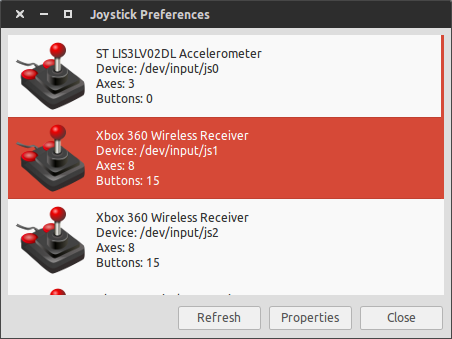

# How do I find out the ID number my joystick?

You can use `jstest-gtk` to find that out. To install it, run

```bash
sudo apt-get install jstest-gtk
```

and run it on the terminal. It will open a window as seen below. The joystick
devices are named `/dev/input/js1` for the device #1. You can use this index
for the launch files that have the input option `joy_id`.



# My machine doesn't seem to see the services and topics from the roscore running remotely

If you are having trouble running your application in multiple computers, you
can try adding the hostnames and IP addresses of your machines to the
`/etc/hosts` file of the computer running `roscore`.

# After running catkin build, I still can't start any nodes or launch files

If after compiling your catkin workspace using `catkin build` ROS seems to not
update the paths to the packages even after you run 

```bash
cd ~/catkin_ws
source devel/setup.bash
```

you can try disabling the option to source the `install` folder of your catkin
workspace by running 

```bash
cd ~/catkin_ws
catkin config --no-install
catkin clean --all
```

Then rebuild your workspace 

```bash
cd ~/catkin_ws
catkin build
source devel/setup.bash
```

# The Gazebo worlds don't start when running the simulation on a virtual machine

To avoid segmentation faults when starting Gazebo in a virtual machine you can
add the following line to your `~/.bashrc` file 

```bash
export LIBGL_ALWAYS_SOFTWARE=1
```

!!! info
    If you are running VirtualBox, remember to install the guest additions to your virtual machine as well.

!!! warning
    It is **strongly** recommended to have your machine running with Linux natively to run the simulation since the performance on virtual machines can be very poor.
