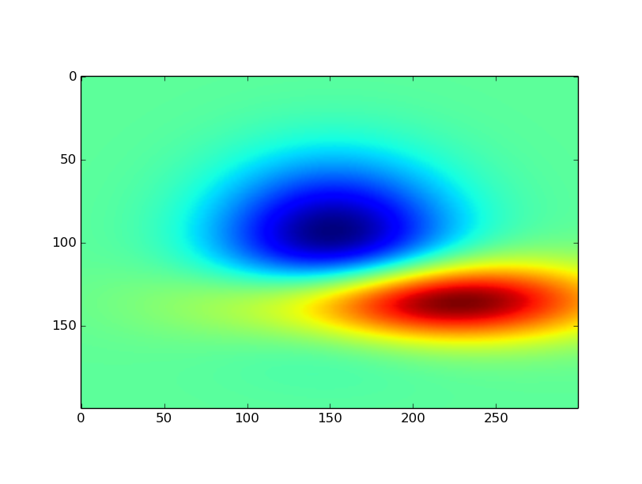
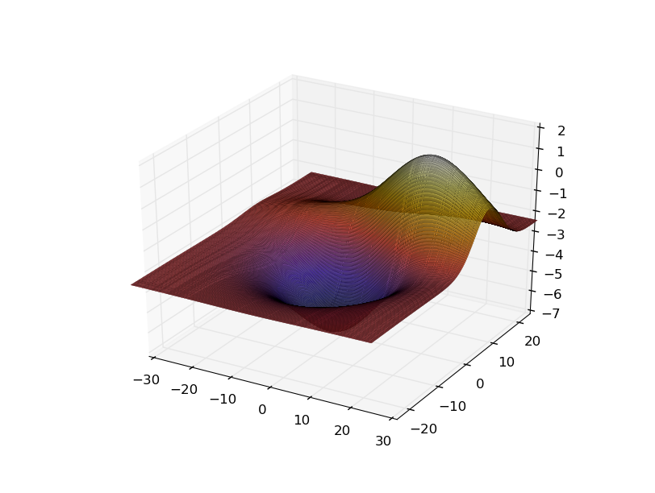
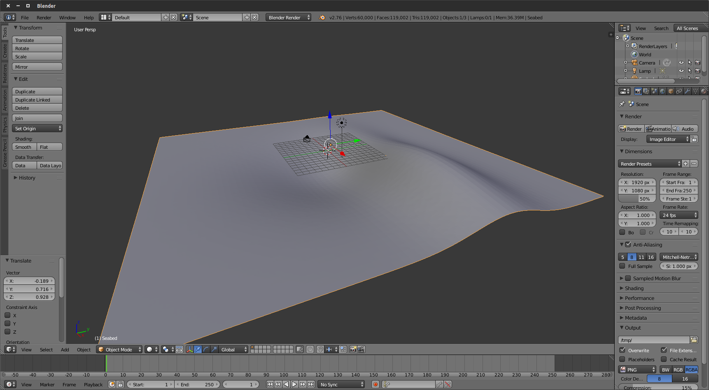
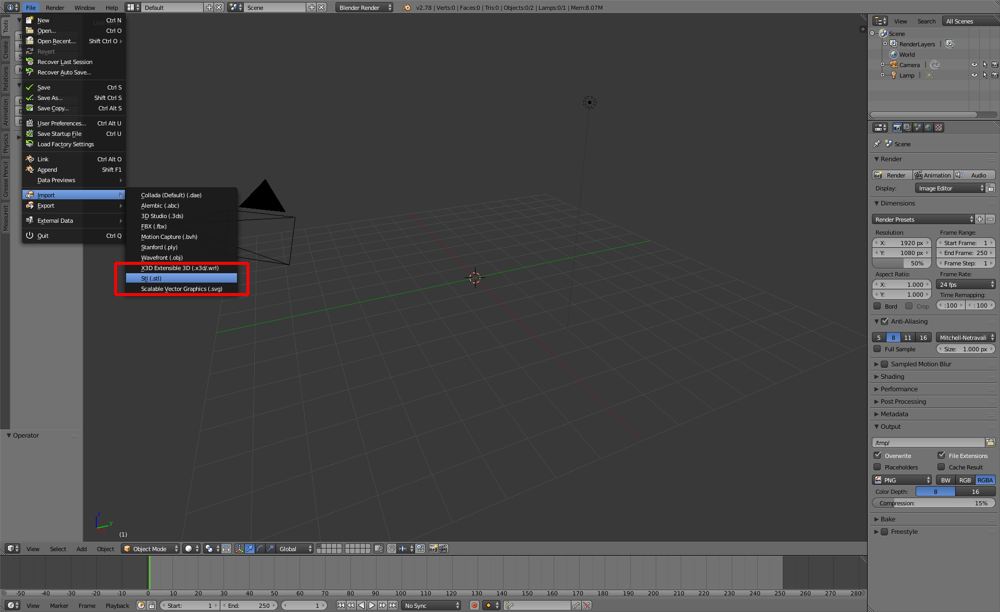
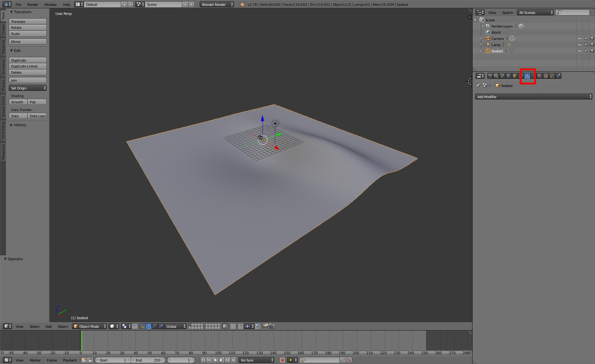
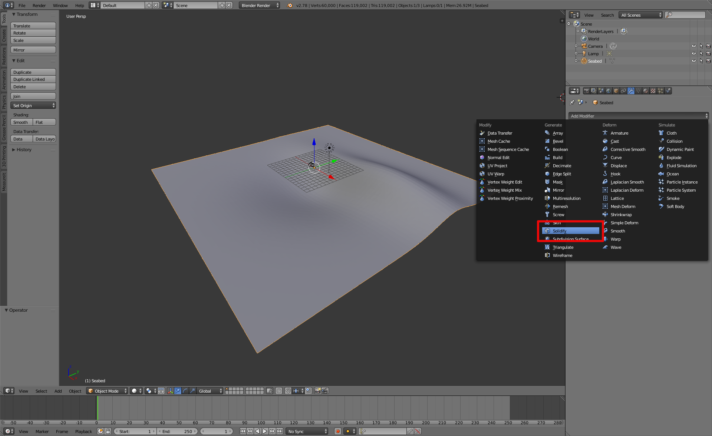
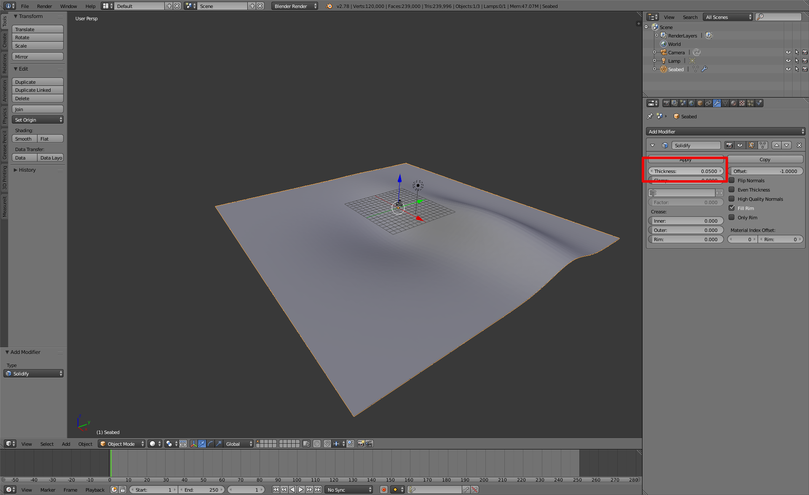
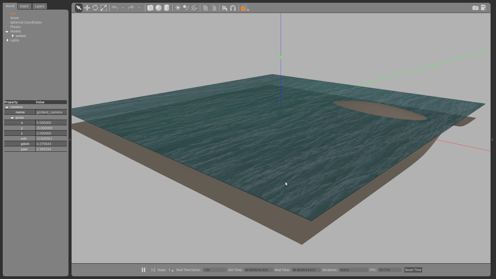
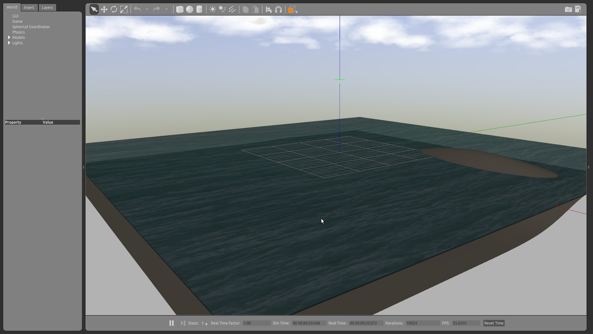

For the following tutorial, all the files can also be found in the [`uuv_tutorial_seabed_world`](https://github.com/uuvsimulator/uuv_simulator/tree/master/uuv_tutorials/uuv_tutorial_seabed_world) package.
The seabed can be critical in simulation scenarios where the objective is, for example, to use UUVs for bathymetric mapping or just to make the scenario look more realistic.
Gazebo already has a feature to generate heightmaps from grayscale images (see the video below). This is a very quick way to setup a heightmap, but it can happen that its complexity might make the simulation run slower when trying to interact with it.

<iframe src="https://player.vimeo.com/video/58409707" width="640" height="360" frameborder="0" webkitallowfullscreen mozallowfullscreen allowfullscreen></iframe>
<p><a href="https://vimeo.com/58409707">Gazebo: Heightmap Tutorial</a> from <a href="https://vimeo.com/osrfoundation">OSRF</a> on <a href="https://vimeo.com">Vimeo</a>.</p>

Another option is to take an existent point cloud of a seabed and convert it into a mesh that can be imported in Gazebo like any other model.

# Creating the mesh file

Measurement data can be sparse and have outliers that need to be removed before generating the mesh. 
The script below is an example on how the measurement data can be interpolated into a grid and later converted into an STL file. For this example, we will use the test surface available in the `matplotlib` package, but you should replace it with your own point cloud data. You will also need the packages `numpy`, `scipy` and `numpy-stl`.

To install the necessary packages, you can use `pip`

```bash
sudo apt install python-pip
pip install numpy scipy matplotlib numpy-stl --user
```

To generate the mesh, change the code below to your needs

```python
import numpy as np
from scipy.interpolate import griddata
import scipy.ndimage as ndimage
from scipy.ndimage import gaussian_filter
from scipy.misc import imsave
from matplotlib import cm
import matplotlib.pyplot as plt
from mpl_toolkits.mplot3d import Axes3D
from stl import mesh, Mode
import matplotlib.tri as mtri
from mpl_toolkits.mplot3d.axes3d import get_test_data

# Generating the surface
x, y, z = get_test_data(delta=0.1)
# Scale the surface for this example
z *= 0.05
# Remember that Gazebo uses ENU (east-north-up) convention, so underwater
# the Z coordinate will be negative
z -= 3
# Note: Gazebo will import your mesh in meters. 

# Point clouds usually don't come in nice grids, so let's make it a (N, 3)
# matrix just to show how it can be done. If you have outliers or noise, you should
# treat those values now.
xyz = np.zeros(shape=(x.size, 3))
xyz[:, 0] = x.flatten()
xyz[:, 1] = y.flatten()
xyz[:, 2] = z.flatten()

# Generate a grid for the X and Y coordinates, change the number of points
# to your needs. Large grids can generate files that are too big for Gazebo, so
# be careful when choosing the resolution of your grid.
x_grid, y_grid = np.meshgrid(np.linspace(xyz[:, 0].min(), xyz[:, 0].max(), 300),
                             np.linspace(xyz[:, 1].min(), xyz[:, 1].max(), 200))

# Interpolate over the point cloud for our grid
z_grid = griddata(xyz[:, 0:2], xyz[:, 2], (x_grid, y_grid),
                  method='linear')

# Option to treat noise
#z_grid = gaussian_filter(z_grid, sigma=1)

# Show the resulting heightmap as an image
fig = plt.figure(figsize=(8, 6))
ax = fig.add_subplot(111)
plt.imshow(z_grid)

# Flatten our interpolated data for triangulation
output = np.zeros(shape=(x_grid.size, 3))
output[:, 0] = x_grid.flatten()
output[:, 1] = y_grid.flatten()
output[:, 2] = z_grid.flatten()

# Triangulation of the interpolated data
tri = mtri.Triangulation(output[:, 0], output[:, 1])

# Show the resulting surface
fig = plt.figure(figsize=(8, 6))
ax = fig.add_subplot(111, projection='3d')
ax.plot_trisurf(tri, output[:, 2], cmap=plt.cm.CMRmap, shade=True, linewidth=0.1)
ax.axis('equal')

# Create the mesh object
seabed_mesh = mesh.Mesh(np.zeros(tri.triangles.shape[0], dtype=mesh.Mesh.dtype))

# Set the vectors
for i, f in enumerate(tri.triangles):
    for j in range(3):
        seabed_mesh.vectors[i][j] = output[f[j]]

# Store the seabed as a STL file
seabed_mesh.save('seabed.stl')

plt.show()
```

Below you can see the resulting heightmap as an image



and the triangulated grid used for the creation of the seabed



Now a `seabed.stl` data has been created or you can download it [here](https://github.com/uuvsimulator/uuv_simulator/blob/master/uuv_tutorials/uuv_tutorial_seabed_world/models/tutorial_seabed/meshes/seabed.stl).
You can open it using [MeshLab](http://meshlab.sourceforge.net/) or [Blender](https://www.blender.org/). Here we will use Blender to show the surface. You can also use Blender to edit the mesh, if necessary.



Even though the surface is ready, if you import it in Gazebo as it is you might not be able to have contact forces if you hit the seabed with your robot. 
One way to solve it is to import the STL in Blender using the STL importer tool



and once the surface is uploaded, go to the **Modifiers** section of the right panel as follows



and choose the option **Solidify** in the **Add modifier** popup menu.



Enter a value for the surface's thickness as shown below and click on the button **Apply**.



You can now export you surface again using the STL exporter tool. Now you need to create a [SDF](http://sdformat.org/) model description of your seabed to load it in Gazebo.

# Creating the Gazebo seabed model

!!! note

    For the further steps, be sure to have followed the installation instructions that can be found in this [page](../installation.md).

To be able to load your seabed mesh in Gazebo, you need a SDF model describing it. 
Starting from the folder structure, let's create a new catkin package for this world description. 
The folder structure below is only a suggestion based on the structure used in this package. 

```bash
cd ~/catkin_ws/src
catkin_create_pkg uuv_tutorial_seabed_world
cd uuv_tutorial_seabed_world
mkdir models worlds launch
mkdir -p models/tutorial_seabed/meshes
```

Let's create the files for our seabed model. 

```bash
cd ~/catkin_ws/src/uuv_tutorial_seabed_world/models/tutorial_seabed
touch model.config model.sdf
```

Now copy the `seabed.stl` file into the folder `uuv_tutorial_seabed_world/models/tutorial_seabed/meshes`.

For the Gazebo seabed model, you will need to create the following files in your `uuv_tutorial_seabed_world/models/tutorial_seabed` folder. The materials used below come from UUV simulator's [materials description](https://github.com/uuvsimulator/uuv_simulator/tree/master/uuv_descriptions/Media/materials).
You can replace them for other textures. You can change them to, for example, the [default materials provided by Gazebo](https://bitbucket.org/osrf/gazebo/src/7d7c37d66d00f1e5e3d96a90734bc61f1f75d8eb/media/materials/scripts/gazebo.material?at=default&fileviewer=file-view-default).

- `model.config`

```xml
<?xml version="1.0"?>
<model>
  <name>Tutorial - Seabed</name>
  <version>1.0</version>
  <sdf version="1.5">model.sdf</sdf>

  <author>
    <name>John Doe</name>
    <email>john.doe@email.com</email>
  </author>

  <description>
    A nice seabed.
  </description>

</model>
```

- **model.sdf**

```xml
<?xml version="1.0" ?>
<sdf version="1.5">
<model name="seabed">
  <static>true</static>
  <link name="seabed_link">

  <visual name="surface">
    <cast_shadows>false</cast_shadows>
    <pose>0 0 0 0 0 0</pose>
    <geometry>
      <box>
        <size>60 60 .1</size>
      </box>
    </geometry>
    <material>
      <script>
        <uri>file://Media/materials/scripts/water.material</uri>
        <name>UUVSimulator/StaticWater</name>
      </script>
    </material>
  </visual>

  <visual name="seafloor">
    <pose>0 0 0 0 0 0</pose>
    <geometry>
      <mesh><uri>model://tutorial_seabed/meshes/seabed.stl</uri><scale>1 1 1</scale></mesh>
    </geometry>
    <material>
      <script>
        <uri>file://Media/materials/scripts/sand.material</uri>
        <name>UUVSimulator/SandAndStones</name>
      </script>
    </material>
  </visual>

  <collision name="seafloor">
    <pose>0 0 0 0 0 0</pose>
    <geometry>
      <mesh><uri>model://tutorial_seabed/meshes/seabed.stl</uri><scale>1 1 1</scale></mesh>
    </geometry>
  </collision>

  </link>
</model>
</sdf>
```

Now you can configure your **catkin package** so that the model can be listed in Gazebo as a model. For that you'll have to configure the `package.xml` and `CMakeLists.txt` files as in the examples below.

- `CMakeLists.txt`

```xml
cmake_minimum_required(VERSION 2.8.3)
project(uuv_tutorial_seabed_world)

find_package(catkin REQUIRED)

catkin_package()

install(DIRECTORY launch worlds models
        DESTINATION ${CATKIN_PACKAGE_SHARE_DESTINATION}
        PATTERN "*~" EXCLUDE)
```

- `package.xml`

For this file, be sure to have the following lines

```xml
<?xml version="1.0"?>
<package format="2">
  <name>uuv_tutorial_seabed_world</name>
  <version>0.6.11</version>
  <description>A simple tutorial on how to create a new Gazebo model with a seabed and how to configure it as a simulation scenario</description>

  <maintainer email="musa.marcusso@de.bosch.com">Musa Morena Marcusso Manhaes</maintainer>
  <maintainer email="sebastian.scherer2@de.bosch.com">Sebastian Scherer</maintainer>
  <maintainer email="luizricardo.douat@de.bosch.com">Luiz Ricardo Douat</maintainer>

  <author email="musa.marcusso@de.bosch.com">Musa Morena Marcusso Manhaes</author>
  <author email="sebastian.scherer2@de.bosch.com">Sebastian Scherer</author>
  <author email="luizricardo.douat@de.bosch.com">Luiz Ricardo Douat</author>

  <license>Apache-2.0</license>

  <buildtool_depend>catkin</buildtool_depend>

  <exec_depend>gazebo_ros</exec_depend>

  <export>
    <gazebo_ros gazebo_media_path="${prefix}"
                gazebo_model_path="${prefix}/models"/>
  </export>
</package>
```

You can now build your workspace as 

```bash
cd ~/catkin_ws
catkin_make
```

or 

```xml
cd ~/catkin_ws
catkin build
```

if you are using `catkin_tools`.

Now, if you open Gazebo using 

```bash
roslaunch gazebo_ros empty_world.launch
```

and delete the `ground_plane` model under the **Models** list, and then select the **Tutorial - Seabed** model from the list at the **Insert** tab, you will be able to see the following screen



# Creating a new Gazebo world

Now that the model is done, you can create a Gazebo world to load your scenario with the seabed model. Create a new world file as follows 

```bash
roscd uuv_tutorial_seabed_world/worlds
touch example_underwater.world
```

and a `launch` file to start it 

```bash
roscd uuv_tutorial_seabed_world/launch
touch tutorial_seabed_world.launch
```

The contents of both files can be seen below

- `example_underwater.world`

```xml
<?xml version="1.0" ?>
<sdf version="1.5">
  <world name="example_underwater">
    <physics name="default_physics" default="true" type="ode">
      <max_step_size>0.002</max_step_size>
      <real_time_factor>1</real_time_factor>
      <real_time_update_rate>500</real_time_update_rate>
      <ode>
        <solver>
          <type>quick</type>
          <iters>50</iters>
          <sor>0.5</sor>
        </solver>
      </ode>
    </physics>
    <scene>
      <ambient>0.01 0.01 0.01 1.0</ambient>
      <sky>
        <clouds>
          <speed>12</speed>
        </clouds>
      </sky>
      <shadows>1</shadows>
    </scene>

    <!-- Global light source -->
    <include>
      <uri>model://sun</uri>
    </include>

    <include>
      <uri>model://tutorial_seabed</uri>
      <pose>0 0 0 0 0 0</pose>
    </include>

    <plugin name="underwater_current_plugin" filename="libuuv_underwater_current_ros_plugin.so">
      <namespace>hydrodynamics</namespace>
      <constant_current>
        <topic>current_velocity</topic>
        <velocity>
          <mean>0</mean>
          <min>0</min>
          <max>5</max>
          <mu>0.0</mu>
          <noiseAmp>0.0</noiseAmp>
        </velocity>

        <horizontal_angle>
          <mean>0</mean>
          <min>-3.141592653589793238</min>
          <max>3.141592653589793238</max>
          <mu>0.0</mu>
          <noiseAmp>0.0</noiseAmp>
        </horizontal_angle>

        <vertical_angle>
          <mean>0</mean>
          <min>-3.141592653589793238</min>
          <max>3.141592653589793238</max>
          <mu>0.0</mu>
          <noiseAmp>0.0</noiseAmp>
        </vertical_angle>
      </constant_current>
    </plugin>

    <plugin name="sc_interface" filename="libuuv_sc_ros_interface_plugin.so"/>

  </world>
</sdf>
```

- `tutorial_seabed_world.launch`

```xml
<launch>
    <arg name="gui" default="true"/>
    <arg name="paused" default="false"/>
    <!-- We resume the logic in empty_world.launch, changing only the name of the world to be launched -->
    <include file="$(find gazebo_ros)/launch/empty_world.launch">
        <!-- Edit the name of the world file (example_underwater.world) when using this template -->
        <arg name="world_name" value="worlds/example_underwater.world"/>
        <arg name="paused" value="$(arg paused)"/>
        <arg name="use_sim_time" value="true"/>
        <arg name="gui" value="$(arg gui)"/>
        <arg name="headless" value="false"/>
        <arg name="debug" value="false"/>
        <arg name="verbose" value="true"/>
    </include>
</launch>
```

Now you can launch your world using 

```bash
roslaunch uuv_tutorial_seabed_world tutorial_seabed_world.launch
```

and the result on the screen should be



Done! Now the custom seabed can be used for your simulation.
