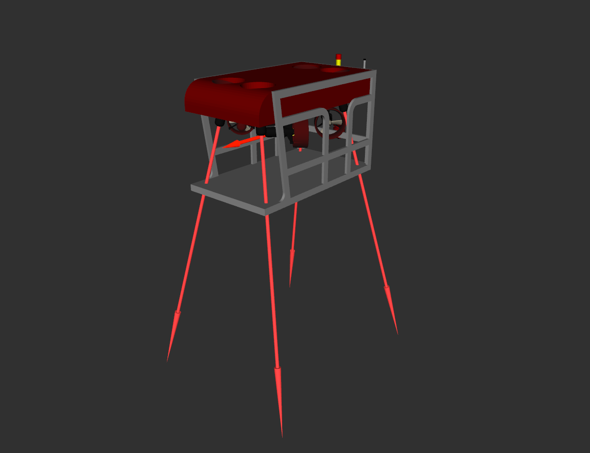

# Configuring the thruster manager for a new vehicle

In order to generate control forces for thruster-actuated vehicles, it is
necessary to compute the **thruster allocation matrix**, which will translate
the output of the controller $\boldsymbol{\tau}_C = (f_x, f_y, f_z, \tau_r, \tau_p, \tau_y)^T$
represented in the vehicle's body frame, where $f_i$ represents the forces
and $\tau_i$ represents the torques, into the output thruster forces
$\tau_i$ for each.

The simulation expects each thruster unit to have its own unique frame, which
enables the use of [`tf`](http://wiki.ros.org/tf) to lookup the transformation
matrix between the vehicle's body frame and each thruster during runtime.
Using this possibility, a package called [`uuv_thruster_manager`](../packages/uuv_simulator/docs/packages/uuv_thruster_manager.md) has been
developed to generate the thruster allocation matrix automatically and
translating the control vector into commands to each thruster.

!!! note

    Check the tutorial [to create a new vehicle](create_new_vehicle.md) to check on how to setup the new underwater vehicle and actuators properly.

To create an initial package with the control configuration for a new vehicle,
run the following in your catkin workspace 

```bash
rosrun uuv_assistants create_thruster_manager_configuration --robot_name <ROBOT_NAME>
```

This script will create a new `<ROBOT_NAME>_control` package with initial
templates for the launch and parameter files. If you already have catkin package
where you want to store these files, run 

```bash
rosrun uuv_assistants create_thruster_manager_configuration --robot_name <ROBOT_NAME> --output_dir <CATKIN_PKG>
```

The folder structure will look like the following 

```
<ROBOT_NAME>_control
|-- config
    |-- thruster_manager.yaml
|-- launch
    |-- start_thruster_manager.launch
`-- CMakeLists.txt
`-- package.xml
```

You should edit the `thruster_manager.yaml` file to include the correct thruster model parameters and topics. Instructions on how to do it can be found in the comments on the same file. Here is an example from the RexROV vehicle thruster manager configuration:

```
thruster_manager:
  tf_prefix: rexrov
  base_link: base_link
  thruster_topic_prefix: thrusters/
  thruster_topic_suffix: /input
  thruster_frame_base: thruster_
  max_thrust: 2000.0
  timeout: -1
  update_rate: 50
  conversion_fcn: proportional
  conversion_fcn_params:
    gain: 0.00031
```

Once the configuration is done, the thruster allocation matrix file should be generated and stored. The `tam` matrix can be generated in runtime everytime the simulation starts, but it is recommended to store and read it from a file since the `tf_listener` can take a long time to find all frames and will therefore make the vehicle inactive for a while at the beginning of the simulation. To do this, you must compile you catkin workspace 

```bash
cd ~/catkin_ws
catkin_make
```

or

```bash
cd ~/catkin_ws
catkin build
```

!!! tip

    You can run ::

    ```bash
    cd ~/catkin_ws
    source devel/setup.sh
    ```

    if after compiling your package seems to not be found.

A `TAM.yaml` file will be stored in the `config` folder once you start a Gazebo world ::

```
roslaunch uuv_gazebo_worlds empty_underwater_world.launch
```

and then include the vehicle 

```bash
roslaunch <ROBOT_NAME>_description upload.launch
```

and finally run 

```bash
roslaunch <ROBOT_NAME>_control start_thruster_manager.launch reset_tam:=true
```

From now on, if you always start the thruster manager using the launch file above (using the `reset_tam` as `false`), you can load the TAM matrix.

To command the vehicle, you have to start the thruster manager and publish a [ROS Wrench message](http://docs.ros.org/api/geometry_msgs/html/msg/Wrench.html) to the input topic

```bash
/<ROBOT_NAME or ROBOT_NAMESPACE>/thruster_manager/input
```

with the wrench command to the vehicle. The thrust forces will be generated at each thruster's unit frame like in the RViz screenshot below.



