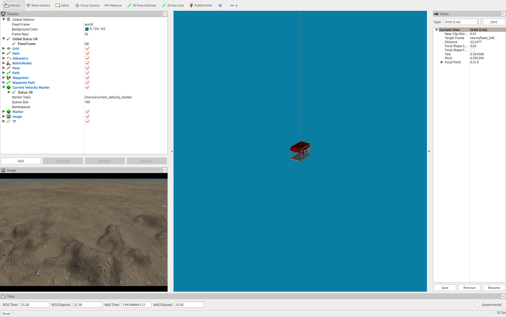
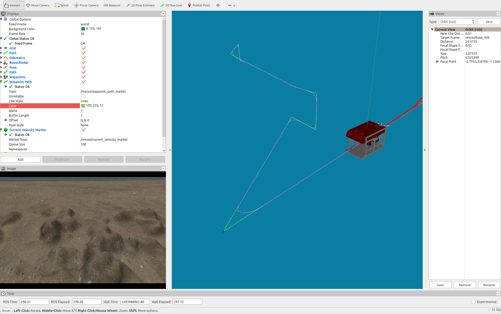

To facilitate the implementation of new control algorithms for the vehicle modelled in this package, a few Python modules were created as an interface to the vehicle's thruster manager, the local planner and setup the necessary publishers and subscribers needed to receive trajectory messages and send thruster commands. 
The module also includes an implementation of Fossen's equations of motion that can be used by model-based controllers. 
To create a controller based on this Python modules, see the following steps. All the files discussed below are available in the package [`uuv_tutorial_dp_controller`](https://github.com/uuvsimulator/uuv_simulator/tree/master/uuv_tutorials/uuv_tutorial_dp_controller) in the [uuv_tutorials](https://github.com/uuvsimulator/uuv_simulator/tree/master/uuv_tutorials) folder. 
Remember to change the name of the package when developing your own module to avoid conflicts when compiling the catkin workspace.

# Creating the custom controller package

First, a new catkin package will be created to include the scripts and launch files necessary for this implementation. Replace the name of the catkin workspace `catkin_ws` below if yours is named differently.

```bash
cd ~/catkin_ws/src
catkin_create_pkg uuv_tutorial_dp_controller
```

This command will create the necessary files for the new package which will be edited further on in this tutorial. Next, two folders are needed, one `launch` folder to the launch files and one `scripts` folder, where the implementation of the custom controller will be stored. 

```bash
cd ~/catkin_ws/src/uuv_tutorial_dp_controller
mkdir launch scripts
```

# Creating the controller node

In the `scripts` folder, a Python file has to be created, here we will name it `tutorial_dp_controller.py`. 

```bash
touch scripts/tutorial_dp_controller.py
```

This file will have the implementation of the controller named `TutorialDPController`, a very simple PID controller, as shown below.

```python
#!/usr/bin/env python
import rospy
import numpy as np
from uuv_control_interfaces import DPControllerBase

class TutorialDPController(DPControllerBase):
  def __init__(self):
      super(TutorialDPController, self).__init__(self)

      self._Kp = np.zeros(shape=(6, 6))
      self._Kd = np.zeros(shape=(6, 6))
      self._Ki = np.zeros(shape=(6, 6))

      self._int = np.zeros(shape=(6,))

      self._error_pose = np.zeros(shape=(6,))

       # Do the same for the other two matrices
      if rospy.get_param('~Kp'):
          diag = rospy.get_param('~Kp')
          if len(diag) == 6:
              self._Kp = np.diag(diag)
              print 'Kp=\n', self._Kp
          else:
              # If the vector provided has the wrong dimension, raise an exception
              raise rospy.ROSException('For the Kp diagonal matrix, 6 coefficients are needed')

      if rospy.get_param('~Kd'):
          diag = rospy.get_param('~Kd')
          if len(diag) == 6:
              self._Kd = np.diag(diag)
              print 'Kd=\n', self._Kd
          else:
              # If the vector provided has the wrong dimension, raise an exception
              raise rospy.ROSException('For the Kd diagonal matrix, 6 coefficients are needed')

      if rospy.get_param('~Ki'):
          diag = rospy.get_param('~Ki')
          if len(diag) == 6:
              self._Ki = np.diag(diag)
              print 'Ki=\n', self._Ki
          else:
              # If the vector provided has the wrong dimension, raise an exception
              raise rospy.ROSException('For the Ki diagonal matrix, 6 coefficients are needed')
      self._is_init = True

  def _reset_controller(self):
      super(TutorialDPController, self)._reset_controller()
      self._error_pose = np.zeros(shape=(6,))
      self._int = np.zeros(shape=(6,))

  def update_controller(self):
      if not self._is_init:
          return False

      if not self.odom_is_init:
          return
      self._int = self._int + 0.5 * (self.error_pose_euler + self._error_pose) * self._dt
      self._error_pose = self.error_pose_euler
      tau = np.dot(self._Kp, self.error_pose_euler) + np.dot(self._Kd, self._errors['vel']) + np.dot(self._Ki, self._int)
      self.publish_control_wrench(tau)

if __name__ == '__main__':
  print('Tutorial - DP Controller')
  rospy.init_node('tutorial_dp_controller')

  try:
      node = TutorialDPController()
      rospy.spin()
  except rospy.ROSInterruptException:
      print('caught exception')
  print('exiting')

```

Analyzing the file in detail, for the controller to use the controller modules from [`uuv_control_interfaces`](https://github.com/uuvsimulator/uuv_simulator/tree/master/uuv_control/uuv_trajectory_control/src/uuv_control_interfaces), it has to inherit the `DPControllerBase` class and initialize it

```python
class TutorialDPController(DPControllerBase):
  def __init__(self):
      super(TutorialDPController, self).__init__(self)
```

This will setup the super class to initialize, for example, odometry message subscribers and thruster manager topic publishers.
For model-based controllers, the super class constructor has to be called as

```python
super(TutorialDPController, self).__init__(self, is_model_based=True)
```

The controller's parameters, in this case $K_p$, $K_d$ and $K_i$ should retrieved from the parameter server to allow the controller to be used in different configurations. One alternative is to read this information from the node's private parameter namespace as shown below. 
This is done by adding a `~` in front of the parameters's tag. The parameter has to be provided at the controller's launch file accordingly, which will be discussed later on.

```python
if rospy.get_param('~Kd'):
  diag = rospy.get_param('~Kd')
  if len(diag) == 6:
      self._Kd = np.diag(diag)
      print 'Kd=\n', self._Kd
  else:
      # If the vector provided has the wrong dimension, raise an exception
      raise rospy.ROSException('For the Kd diagonal matrix, 6 coefficients are needed')
```

The `_reset_controller` method can be overriden in case internal variables must be reset when the reset service call is received.
It is important to also call the super class' reset method as seen below to ensure that error and reference vectors are also going to be cleared.

```python
  super(TutorialDPController, self)._reset_controller()
```

When using the super class `DPControllerBase`, there is no need to add an controller update sequence or a timer. 
Once the method `update_controller` is implemented in the controller class, it will be given as a callback function to the odometry update method.
This update method should include the controller's algorithm and generate the control effort vector (in this case $\tau$) and use the super class function `publish_control_wrench` to publish it to the thruster manager input.

The last part of the file is necessary for the ROS node to be executed.

```python
if __name__ == '__main__':
  print('Tutorial - DP Controller')
  rospy.init_node('tutorial_dp_controller')

  try:
      node = TutorialDPController()
      rospy.spin()
  except rospy.ROSInterruptException:
      print('caught exception')
  print('exiting')
```

# Configuring the launch files

Once the custom controller is done, you have to turn your Python script into an executable and it can be done as follows, otherwise you will not be able to start the ROS node. 

```bash
chmod u+x tutorial_dp_controller.py
```

Next step is to setup the launch file for the new controller. Create a new launch file as follows 

```bash
  cd ~/catkin_ws/src/uuv_tutorial_dp_controller/launch
  touch start_tutorial_dp_controller.launch
``` 

Edit the file to include the following

```xml
<launch>
  <arg name="uuv_name"/>
  <arg name="model_name" default="$(arg uuv_name)"/>
  <arg name="saturation" default="5000"/>

  <arg name="Kp" default="11993.888,11993.888,11993.888,19460.069,19460.069,19460.069"/>
  <arg name="Kd" default="9077.459,9077.459,9077.459,18880.925,18880.925,18880.925"/>
  <arg name="Ki" default="321.417,321.417,321.417,2096.951,2096.951,2096.951"/>

  <arg name="output_dir" default="$(find uuv_thruster_manager)/config/$(arg model_name)"/>
  <arg name="config_file" default="$(find uuv_thruster_manager)/config/$(arg model_name)/thruster_manager.yaml"/>
  <arg name="tam_file" default="$(find uuv_thruster_manager)/config/$(arg model_name)/TAM.yaml"/>

  <include file="$(find uuv_thruster_manager)/launch/thruster_manager.launch">
      <arg name="uuv_name" value="$(arg uuv_name)"/>
      <arg name="model_name" value="$(arg model_name)"/>
      <arg name="output_dir" value="$(arg output_dir)"/>
      <arg name="config_file" value="$(arg config_file)"/>
      <arg name="tam_file" value="$(arg tam_file)"/>
  </include>

  <group ns="$(arg uuv_name)">
      <node pkg="uuv_control_utils"
            type="trajectory_marker_publisher.py"
            name="trajectory_marker_publisher"
            output="screen">
          <remap from="trajectory" to="dp_controller/trajectory"/>
          <remap from="waypoints" to="dp_controller/waypoints"/>
      </node>

      <node pkg="uuv_tutorial_dp_controller"
          type="tutorial_dp_controller.py"
          name="tutorial_dp_controller"
          output="screen">
          <remap from="odom" to="pose_gt"/>
          <remap from="trajectory" to="dp_controller/trajectory"/>
          <remap from="input_trajectory" to="dp_controller/input_trajectory"/>
          <remap from="waypoints" to="dp_controller/waypoints"/>
          <remap from="error" to="dp_controller/error"/>
          <remap from="reference" to="dp_controller/reference"/>
          <remap from="thruster_output" to="thruster_manager/input_stamped"/>
          <rosparam subst_value="true">
              saturation: $(arg saturation)
              Kp: [$(arg Kp)]
              Kd: [$(arg Kd)]
              Ki: [$(arg Ki)]
          </rosparam>
      </node>
  </group>
</launch>
```

The most important parts of the launch file to notice is that the vehicle namespace `uuv_name` must always be provided, since the simulation per default will have nodes specific to the operation of each vehicle created inside their namespaces. The thruster manager must also be initialized.

!!! info

    For more information on how to setup the thruster manager, check the [tutorial about configuration of the thruster manager](config_thruster_manager.md).

Finally, the controller node has to be called, along with the correct parameters set by the arguments $K_p$, $K_d$ and $K_i$ in this example. You can pass this parameters by command line or set default vectors as seen above, but there should be no spaces between commas and values. They have to be set in the `rosparam` block. The `trajectory_marker_publisher` is an optional node used only to publish visual markers.

To start a small demonstration using the RexROV vehicle, you can create another launch file as follows 

```bash
cd ~/catkin_ws/src/uuv_tutorial_dp_controller/launch
touch start_tutorial_dp_controller_demo.launch
```

and initialize a world, the vehicle and the RViz visualization tool as follows

```xml
<launch>
    <!-- This launch file will start the controller nodes with the necessary parameters -->

    <!--
    Vehicle namespace: since the simulation can run with multiple vehicle, each vehicle
    is created under a namespace, which is per default equal to the name of vehicle model, but
    can be assigned differently at startup
    -->
    <arg name="uuv_name"/>
    <!-- Name of the vehicle model: the name of the robot model -->
    <arg name="model_name" default="$(arg uuv_name)"/>

    <!-- Control effort saturation -->
    <arg name="saturation" default="5000"/>

    <!--
    The controller parameters are given below and will be given to the controller node in its
    private namespace. These are vectors and for roslaunch to see this as one argument, there
    can be no spaces between the commas and the floating point values. The default values
    are usually the ones that are going to be used.
    -->
    <arg name="Kp" default="11993.888,11993.888,11993.888,19460.069,19460.069,19460.069"/>
    <arg name="Kd" default="9077.459,9077.459,9077.459,18880.925,18880.925,18880.925"/>
    <arg name="Ki" default="321.417,321.417,321.417,2096.951,2096.951,2096.951"/>

    <arg name="output_dir" default="$(find uuv_thruster_manager)/config/$(arg model_name)"/>
    <arg name="config_file" default="$(find uuv_thruster_manager)/config/$(arg model_name)/thruster_manager.yaml"/>
    <arg name="tam_file" default="$(find uuv_thruster_manager)/config/$(arg model_name)/TAM.yaml"/>
    <!--
    For the control vector to be distributed amongst the thrusters, a thruster manager node
    has to be initialized for this specific vehicle. The thruster manager will calculate the
    thruster allocation matrix if none is provided, but it is better if the TAM is stored
    in a YAML file beforehand. Check the tutorial on how to initialize the thruster allocation
    matrix.
    -->
    <include file="$(find uuv_thruster_manager)/launch/thruster_manager.launch">
        <!--
        The thruster manager will use the namespace uuv_name to initialize the node and
        will use the robot's model_name to search for the YAML file containing the thruster
        allocation matrix.
        -->
        <arg name="uuv_name" value="$(arg uuv_name)"/>
        <arg name="model_name" value="$(arg model_name)"/>
        <arg name="output_dir" value="$(arg output_dir)"/>
        <arg name="config_file" value="$(arg config_file)"/>
        <arg name="tam_file" value="$(arg tam_file)"/>
    </include>

    <!--
    It is important to start all nodes relative to this vehicle under the vehicle's
    namespace in order to avoid errors and parameter being initialized in wrong place.
    Most of the nodes per default are going to look for configuration parameters and
    topics under the vehicle's namespace per default.
    -->
    <group ns="$(arg uuv_name)">
        <!--
        This node just reads the trajectory and waypoint topics and publishes visualization
        markers to RViz, but is not essential to the controller's operation
        -->
        <node pkg="uuv_control_utils"
              type="trajectory_marker_publisher.py"
              name="trajectory_marker_publisher"
              output="screen">
            <remap from="trajectory" to="dp_controller/trajectory"/>
            <remap from="waypoints" to="dp_controller/waypoints"/>
        </node>

        <!--
        Start the vehicle controller node. Remember to include this controller's script
        correctly in the CMakeLists.txt file of your catkin package. This can be done by
        adding the following line in the CMakeLists.txt after the line where catkin_package()
        is given:

        catkin_install_python(PROGRAMS scripts/tutorial_dp_controller.py DESTINATION ${CATKIN_PACKAGE_BIN_DESTINATION})

        The scripts/tutorial_dp_controller.py file must also be set as an executable as follows

        >> cd <path_to_ros_package>/scripts
        >> chmod 777 tutorial_dp_controller.py
        -->

        <node pkg="uuv_tutorial_dp_controller"
            type="tutorial_dp_controller.py"
            name="tutorial_dp_controller"
            output="screen">
            <!-- Remap necessary topics -->
            <remap from="odom" to="pose_gt"/>
            <remap from="trajectory" to="dp_controller/trajectory"/>
            <remap from="input_trajectory" to="dp_controller/input_trajectory"/>
            <remap from="waypoints" to="dp_controller/waypoints"/>
            <remap from="error" to="dp_controller/error"/>
            <remap from="reference" to="dp_controller/reference"/>
            <remap from="thruster_output" to="thruster_manager/input_stamped"/>
            <!-- Set the controller parameters in the node's private namespace-->
            <rosparam subst_value="true">
                saturation: $(arg saturation)
                Kp: [$(arg Kp)]
                Kd: [$(arg Kd)]
                Ki: [$(arg Ki)]
            </rosparam>
        </node>
    </group>

    <!--
    Now run the demo file to start a new simulation with this controller

    >> roslaunch uuv_tutorial_dp_controller start_tutorial_dp_controller_demo.launch
    -->
</launch>
```

Before you can run this demo, the package has to be configured.

# Configuring the package

To allow catkin to install all your modules, you can open the `CMakeLists.txt` file from your catkin package and edit it to look like in the example below.

``` 
cmake_minimum_required(VERSION 2.8.3)
project(uuv_tutorial_dp_controller)

find_package(catkin REQUIRED)

catkin_package()

catkin_install_python(PROGRAMS scripts/tutorial_dp_controller.py DESTINATION ${CATKIN_PACKAGE_BIN_DESTINATION})

install(DIRECTORY launch
        DESTINATION ${CATKIN_PACKAGE_SHARE_DESTINATION}
        PATTERN "*~" EXCLUDE)
```

# Running the simulation

After you compile you workspace again with `catkin_make` or `catkin build`, you can run the demo launch file created before. 

```bash
roslaunch uuv_tutorial_dp_controller start_tutorial_dp_controller_demo.launch
```

This will start the Gazebo simulator with an instance of the RexROV vehicle with this custom controller being used for positioning.



You can use one the modules from the [`uuv_control_utils`](../packages/uuv_simulator/docs/packages/uuv_control_utils.md) package to send the vehicle some waypoints and see the controller in action. For example, use the [default list of waypoints](https://github.com/uuvsimulator/uuv_simulator/blob/master/uuv_control/uuv_control_utils/config/example_waypoints.yaml) and send them to the controller by using 

```bash
roslaunch uuv_control_utils send_waypoints_file.launch uuv_name:=rexrov
```

The local planner in `uuv_control_interfaces` that is used per default by the `DPControllerBase` class will receive the waypoints and apply a linear interpolation with polynomial blends to generate a path to be followed by the vehicle.


