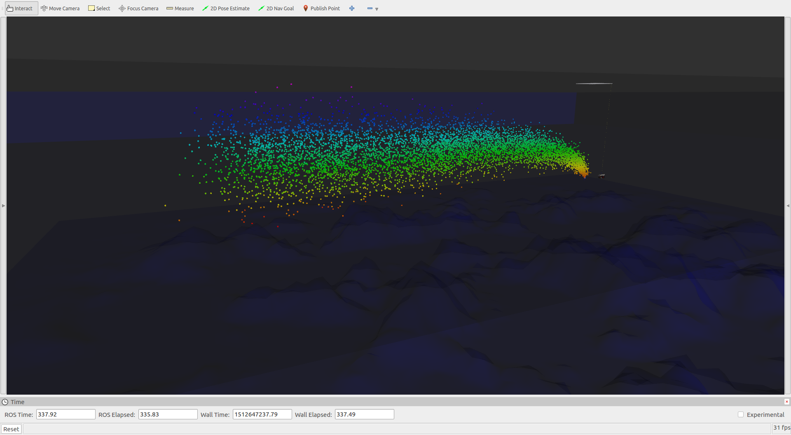
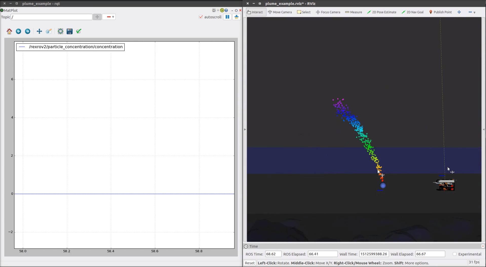
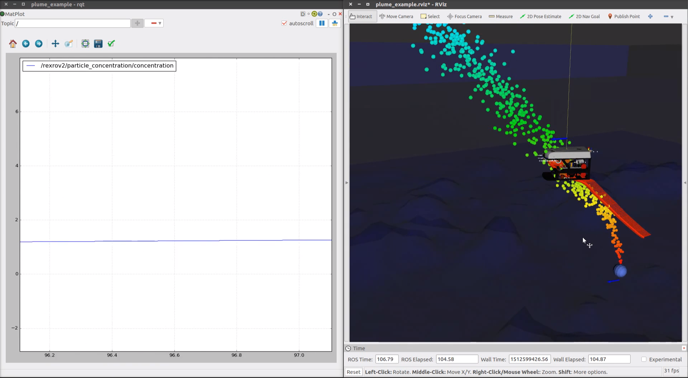

Tracking and/or mapping of chemical plumes is one of the use-cases often addressed when regarding guidances strategies for AUVs.
It presents also a challenge when setting up a simulation in order to design the desired algorithm since the setup of the real experiment can present various types of challenges and can hardly be repeated under the same conditions.

For this objective, the algorithm presented in [`Tian, 2010`](https://ieeexplore.ieee.org/abstract/document/5456812/) for both the dynamics of plume particles and the particle concentration sensor have been implemented in the [`uuv_plume_simulation`](https://github.com/uuvsimulator/uuv_plume_simulator).
For a detailed explanation on the implementation of a passive scalar turbulent plume, please refer to [`Tian, 2010`](https://ieeexplore.ieee.org/abstract/document/5456812/) and the ROS implementation for the particle generation [here](https://github.com/uuvsimulator/uuv_plume_simulator/blob/master/uuv_plume_simulator/src/uuv_plume_model/passive_scalar_turbulence.py).

To run this ROS node, be sure to clone the package in your catkin workspace as follows 

```bash
cd ~/catkin_ws/src
git clone https://github.com/uuvsimulator/uuv_plume_simulator.git
```

and build it 

```bash
cd ~/catkin_ws
catkin build
source devel/setup.bash
```

To run the plume generator ROS node, call the demo launch file 

```bash
roslaunch uuv_plume_simulator start_plume_example.launch
```

One script is already available to setup an example of a turbulent plume model in the package and can be initialized by calling

```bash
rosrun uuv_plume_simulator set_demo_turbulent_plume
```

If no current is active in the Gazebo world, the particles will accumulate around the plume source. To start a current velocity model, run the script 

```bash
rosrun uuv_plume_simulator set_current_vel
```

By changing the current, it is possible to steer the plume.
To measure the particle concentration using the algorithm described in [`Tian, 2010`](https://ieeexplore.ieee.org/abstract/document/5456812/), the vehicle must have a sensor unit from the chemical particle concentration available in the [`uuv_sensor_ros_plugins`](../packages/uuv_simulator/docs/packages/uuv_sensor_ros_plugins.md).
A number of URDF snippets to initialize this sensor in the URDF robot description can be found in the [sensor package](https://github.com/uuvsimulator/uuv_simulator/blob/master/uuv_sensor_plugins/uuv_sensor_ros_plugins/urdf/chemical_concentration_snippets.xacro).
One example of implementation is already presented in the description of the [`rexrov2`](../packages/rexrov2/intro.md) vehicle in the declaration of its [sensor units](https://github.com/uuvsimulator/rexrov2/blob/master/rexrov2_description/urdf/rexrov2_sensors.xacro) as shown below 

```xml
<!-- Mount chemical particle concentration sensor -->
<xacro:default_chemical_concentration_sensor_macro
  namespace="${namespace}"
  parent_link="${namespace}/base_link"
  inertial_reference_frame="${inertial_reference_frame}">
  <origin xyz="0 0 0" rpy="0 0 0"/>
</xacro:default_chemical_concentration_sensor_macro>
```

A sample of the output in `rviz` and `rqt` can be seen below.
Feel free to check the sample [plume script](https://github.com/uuvsimulator/uuv_plume_simulator/blob/master/uuv_plume_simulator/scripts/set_demo_turbulent_plume) and the [URDF sensor snippets](https://github.com/uuvsimulator/uuv_simulator/blob/master/uuv_sensor_plugins/uuv_sensor_ros_plugins/urdf/chemical_concentration_snippets.xacro) to see the input arguments that can be changed to modify both the plume and concentration sensor settings.






